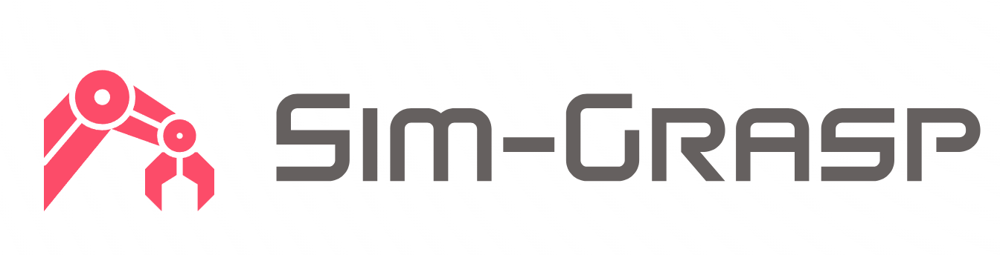

# 🚀 Sim-Grasp

   
  <strong>Sim-Grasp</strong> Learning 6-DOF Grasp Policies for Cluttered Environments Using a Synthetic Benchmark. 
  Juncheng Li, David J. Cappelleri. 
<a href="https://arxiv.org/abs/2405.00841">Paper</a> |
<a href="https://junchengli1.github.io/Sim-Grasp-Web/"><strong>Project Website</strong></a>

## Table of Contents
- [Cluttered Environment Generation](#cluttered-environment-generation)
- [Grasping Candidates Annotation](#grasping-candidates-annotation)

## Cluttered Environment Generation

For dataset generation and simulation environment, refer to our previous work, <a href="https://github.com/junchengli1/Sim-Suction-API"><strong>Sim-Suction</strong></a>, which supports the generation of cluttered environments using Isaac Sim simulator.

## Grasping Candidates Annotation

Use the [`two_finger_sampling_angle_aug.py`](grasp_sampling/two_finger_sampling_angle_aug.py) script to sample grasp candidates and check collisions.

Use the [`grasp_simulation.py`](grasp_sampling/grasp_simulation.py) script to perform dynamic evaluation.